# Índice
1. [Instalación de VM](#vm)
1. [Instalación de BURP](#burp)
1. [Instalación de Visual Studio Code](#vscode)
1. [Instalación de Docker](#docker)
1. [Ejecución de OWASP Juice Shop](#juice-shop)
1. [Ejecución de Crappi](#crappi)
1. [Prueba de la visualización del tráfico](#visualizacion)

# Instalación de VM <a name="vm" />

El hypervisor que utilizaré es libvirtd, con la interfaz virt-manager, debido a
que utilizo Linux como SO huesped, y Virtualbox tiene peor rendimiento que
libvirtd.

Para la instalación, se crea una máquina virtual nueva. Para asegurar que no
falten recursos, le dedico 8GB de RAM, y 4 núcleos del CPU. En la máquina,
distribuyo los núcleos con una topología de 2 núcleos y 2 hilos por
núcleo[^cpunote]. A su vez, le dedico una imagen de disco de 40GB a la VM, para
prevenir problemas de espacio de disco. Aunque Kali sea un SO liviano, es mejor
tener el espacio disponible. Además, al hacerlo con una imagen dinámica, no me
ocupa los 40GB en el disco físico hasta que los utilice, lo cual permite no
utilizar tantos recursos de la máquina.

[^cpunote]: Aclaro esto porque libvirtd por defecto marca la topología como N
    sockets virtuales para la VM, y no lo sensato de que sea un solo CPU con
varios núcleos/hilos

Al crear la VM le monto el ISO descargado de
[aquí](https://www.kali.org/get-kali/#kali-installer-images) como un CD
externo, para poder bootear del ISO. Luego, al iniciar la VM, simplemente sigo
los pasos estándar de instalación de Kali. Los datos ingresados notables son
los siguientes:
- El hostname queda marcado como `kalidesarrollo`
- El nombre del usuario creado es `guz`
- La región es Uruguay, y el huso horario es `America/Montevideo`
- El particionado es simple, con una sola partición
- El DE es Xfce, y todas las herramientas son seleccionadas

Y al finalizar la instalación, se eyecta el ISO de la VM y queda pronta. Para
seguridad voy a tomar snapshots en cada paso del proceso, así que aquí sería
la primera.

Como esta máquina es para pruebas de seguridad, no tiene sentido permitir
acceso al sistema de archivos o el clipboard del huésped, y por ende estos
aspectos no serán configurados, pese a que serían útiles en la utilización de
la VM.

# Instalación de BURP <a name="burp" />

Una vez iniciada la VM, se puede instalar el proxy de intercepción en esta.
Para este práctico, utilizaré BURP suite, ya que viene instalado por defecto
en el paquete de software que instala Kali.

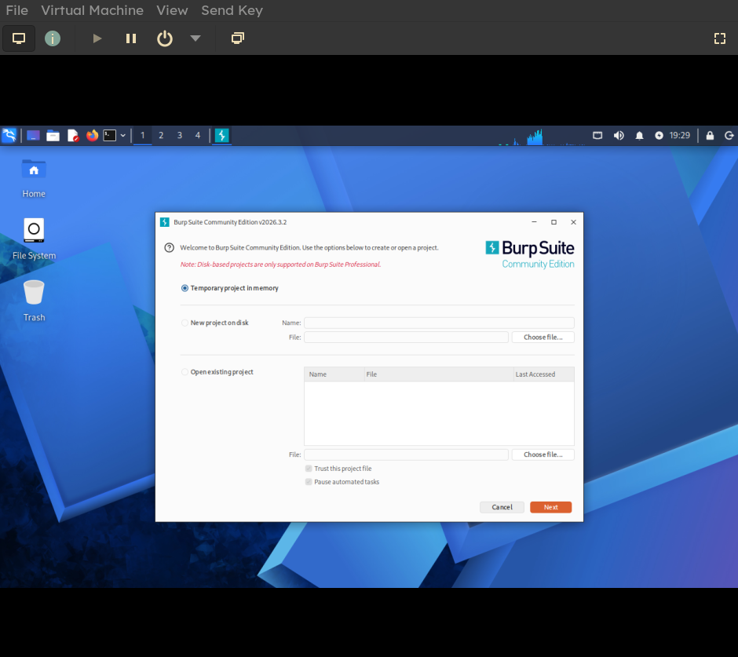

Una vez iniciado BURP, para efectos de demostración se sigue en un proyecto en
memoria, efímero. Con el proyecto creado, en la pestaña de `Proxy` se pueden
visualizar las opciones de proxy. Sin embargo, no captura todo el tráfico
HTTP(S) de la máquina, sino que se debe usar el navegador del proxy, o apuntar
el navegador a usar el servidor de BURP como proxy para capturarlo.

Para mayor comodidad, voy a configurar a Firefox (navegador incluido por
defecto en Kali) para que utilice el proxy, y no usar el navegador de BURP
Suite. Para esto, hay que conocer la dirección en la que BURP expone el
proxy. Por defecto está configurado para escuchar en `localhost:8080`, aunque
esto se pueda cambiar.

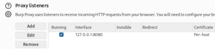

Para este práctico, lo dejaré así. En Firefox se debe configurar en los ajustes
de red los ajustes de proxy, y utilizar el proxy que corre BURP suite.

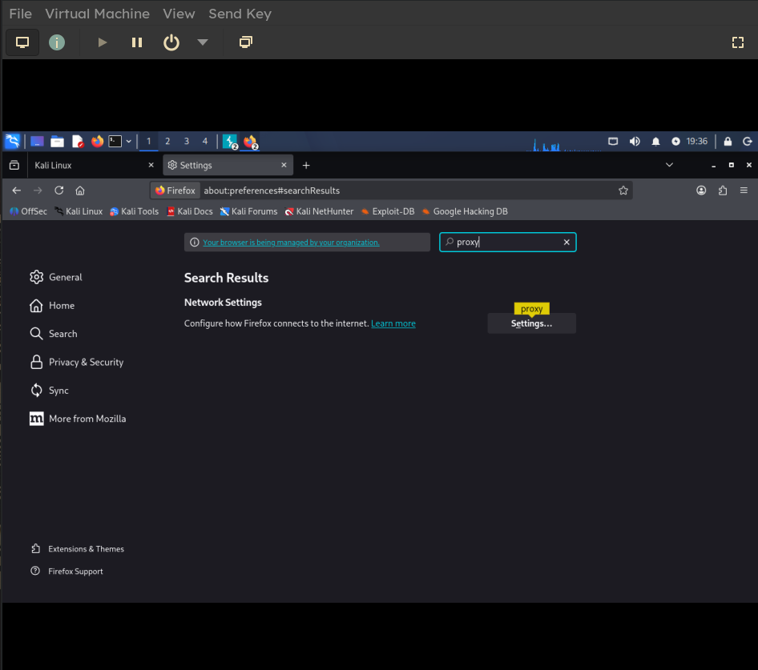
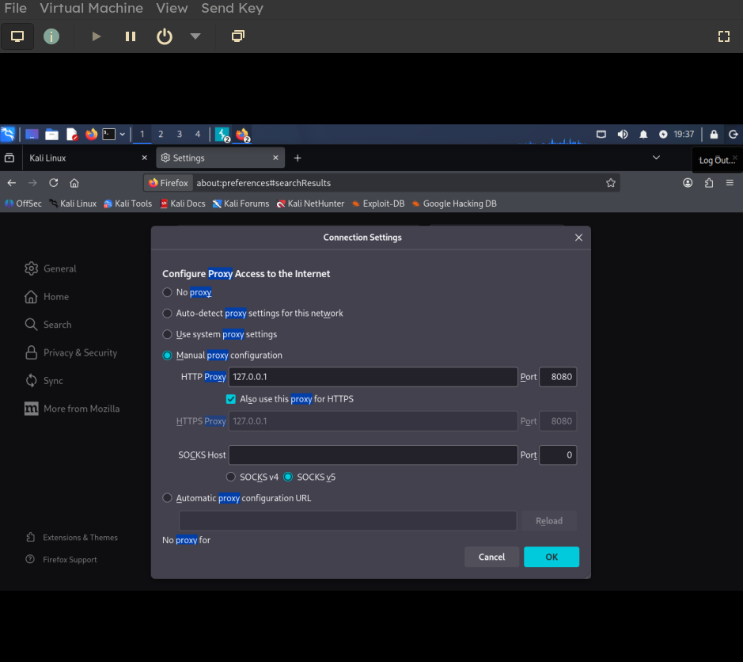

Con estos ajustes, el navegador utilizará el proxy para enviar todo el tráfico
HTTP y HTTPS. Se puede comprobar que con HTTP inseguro se puede alcanzar el sitio
sin ningún problema, y que se puede inspeccionar el tráfico en BURP.

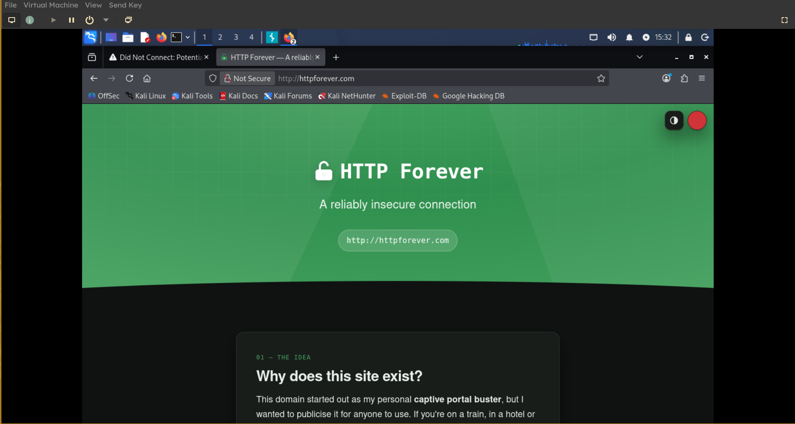
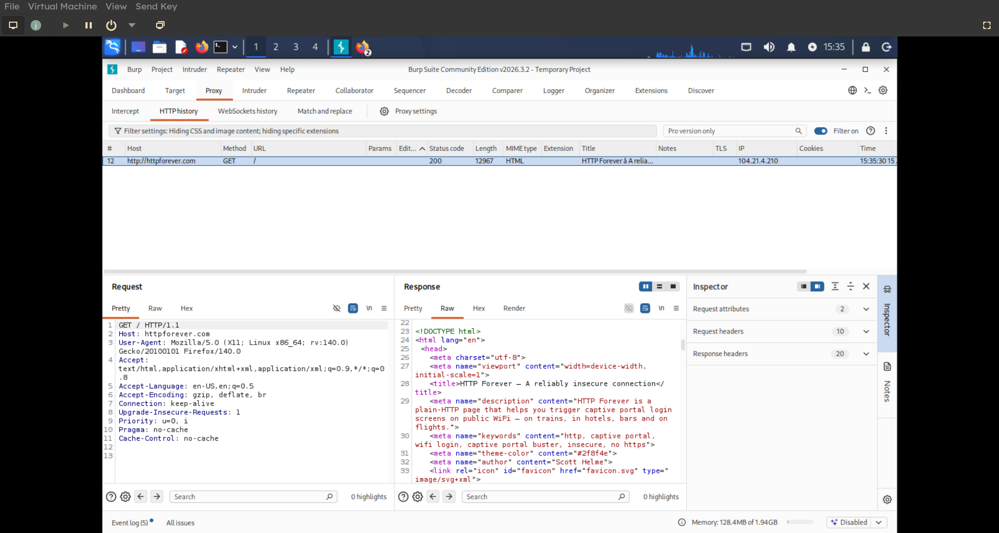

A su vez, esto implica que si el proxy no corre, Firefox no puede enviar el
tráfico por el proxy, y por ende no puede enviar el tráfico a nada, y en
la configuración por defecto.

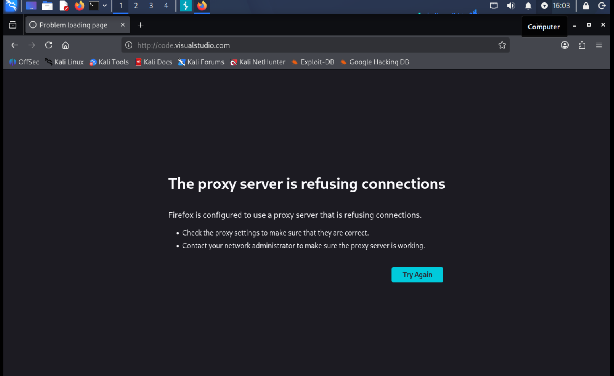

Sin embargo, con HTTPS directamente no se puede alcanzar al sitio. Esto es
porque, para poder inspeccionar el tráfico HTTPS, debe hacer un MITM respecto a
la encripción, desencriptando la solicitud del navegador, encriptándola de
nuevo, y luego hacer lo mismo con la respuesta del servidor.

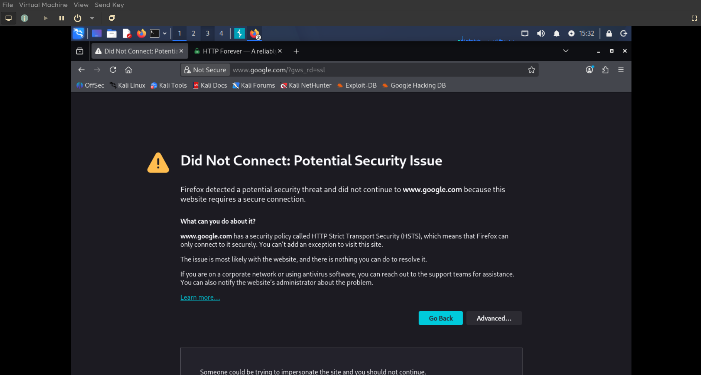

En HTTPS se utiliza encripción asimétrica. La clave pública es expuesta por el
servidor, y el cliente encripta la comunicación con esta clave, que luego el
servidor desencripta con su clave privada. Para asegurar que estas claves sean
seguras y pertenezcan a la página a la que uno quiere acceder, se utiliza el
concepto de Autoridades de Certificación (CAs): entidades cuyos certificados el
navegador (o bien el SO) tiene pre-cargados. Los certificados que el navegador
recibe son verificados, a través de su firma, con algún CA y así se garantiza
que no ocurren ataques que cambien el certificado para interceptar el tráfico,
ya que los CA no firman certificados para cualquiera.

Precisamente esto es lo que queremos hacer: interceptar el tráfico con un
certificado que creamos nosotros. La solución entonces sería firmar los
certificados con la clave de algún CA que reconozca Firefox. Los que existen
ahí, para evitar vulnerar la seguridad digital del mundo, no van a entregar sus
certificados, ni tampoco firmar cualquier certificado que uno cree. La única
opción entonces sería ingresar un nuevo certificado a la lista de CAs. Esto es
justamente lo que BURP asume que sucede, como se puede apreciar en el
certificado que le envía el proxy a Firefox.

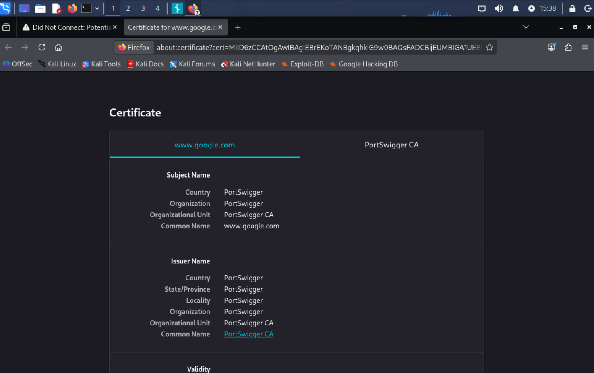

Para que se pueda seguir con la comunicación, Firefox debe confiar en el
certificado de PortSwigger, y así poder encriptar la comunicación. Justamente,
BURP permite exportar el certificado privado que utiliza el proxy para este
propósito, que luega se puede importar en Firefox.

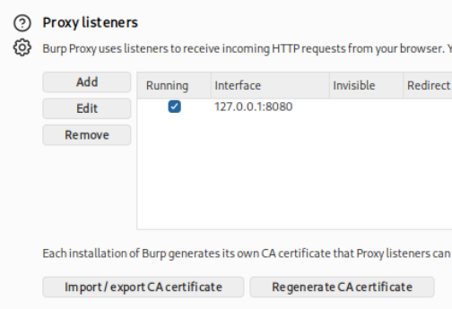
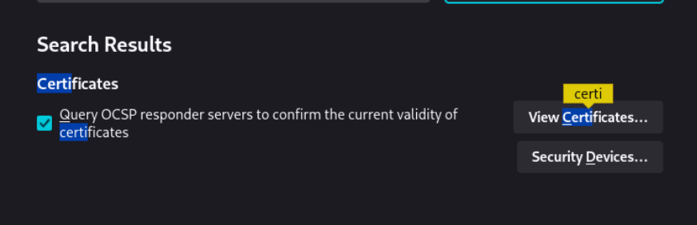
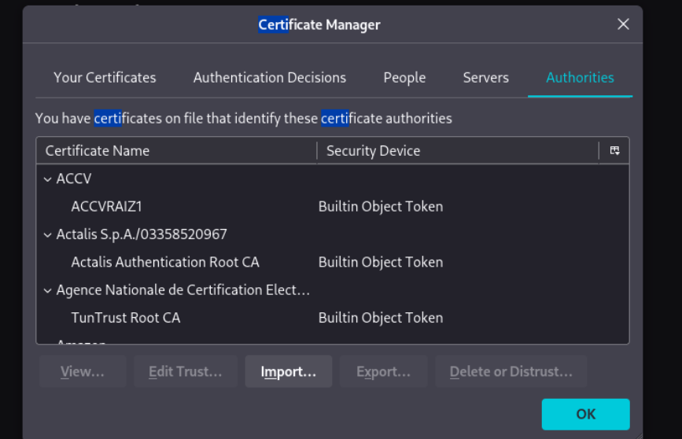
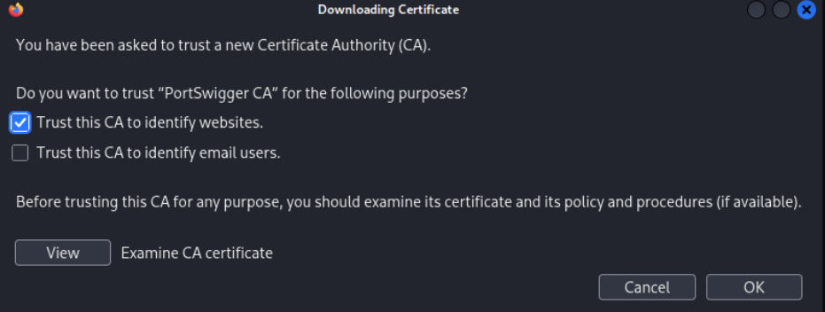

Después de importar el certificado, se puede navegar a una página asegurada por
HTTPS e interceptar el tráfico, de manera normal. Nótese que el certificado que
muestra la página es el de PortSwigger, y no el original de Google.

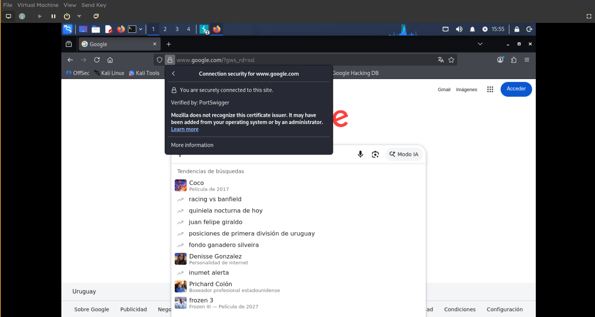
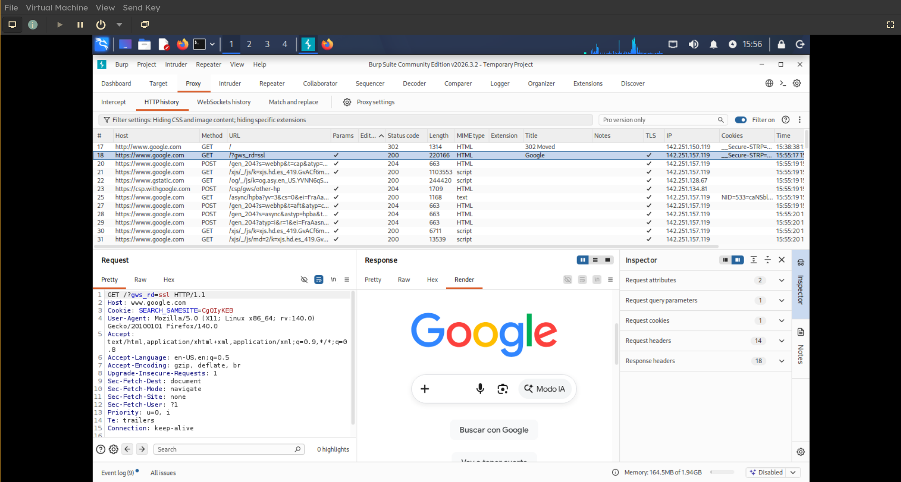

# Instalación de Visual Studio Code <a name="vscode" />

Para esto, se puede seguir la guía
[aquí](https://code.visualstudio.com/docs/setup/linux) para distros basadas
en Debian, como Kali. La replicaré aquí, para completitud.

Para instalar vscode, se debe instalar el repositorio de `apt` de Microsoft.

El primer paso es instalar la clave gpg de Microsoft para verificar el repo.

```bash
sudo apt install wget gpg
wget -qO- https://packages.microsoft.com/keys/microsoft.asc | sudo gpg --dearmor -o /usr/share/keyrings/microsoft.gpg
```

Luego, se crea la configuración del repo utilizando esta clave.

```bash
echo "Types: deb
URIs: https://packages.microsoft.com/repos/code
Suites: stable
Components: main
Architectures: amd64,arm64,armhf
Signed-By: /usr/share/keyrings/microsoft.gpg
" | sudo tee /etc/apt/sources.list.d/vscode.sources
```

Y finalmente, se sincronizan los metadatos y se instala el paquete

```bash
sudo apt update
sudo apt install code
```

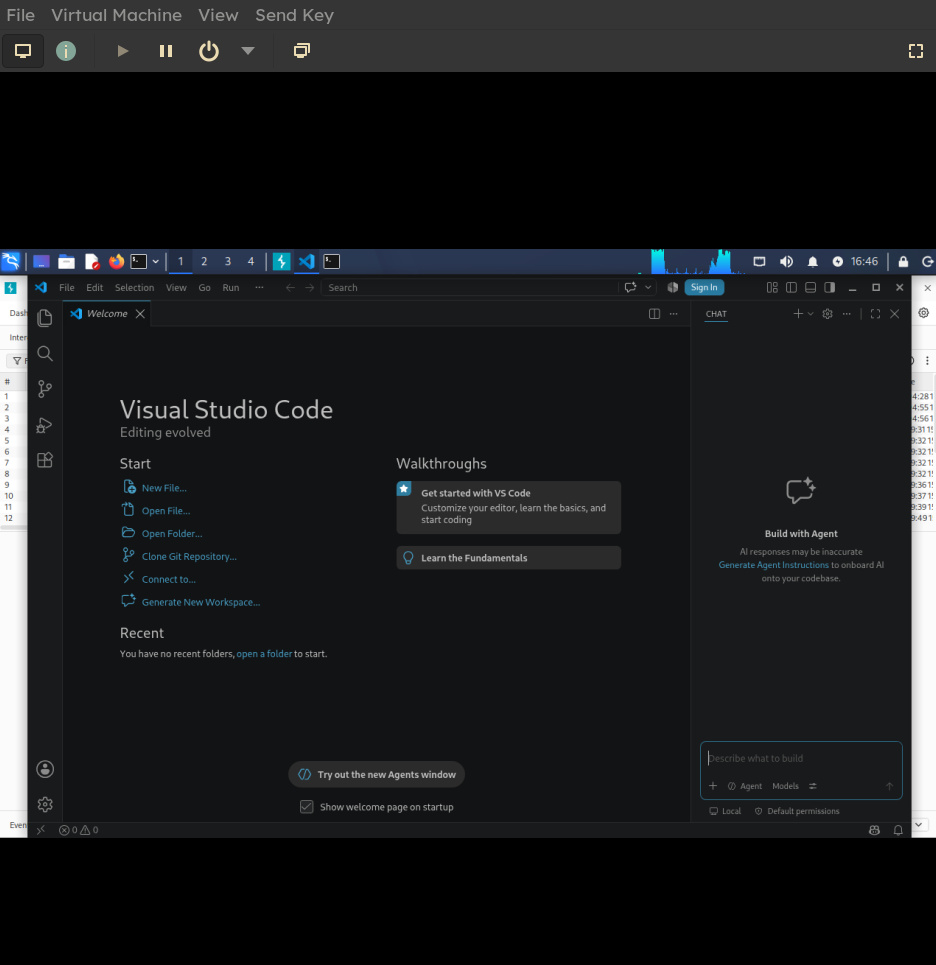

# Instalación de Docker <a name="docker" />

Con Docker es un procedimiento similar, se debe instalar el repo de `apt` de
docker, y luego instalar Docker. Se seguirá la guía
[aquí](https://www.debian.org/releases/stable/), instalando `docker-ce` y no la
versión de Kali porque esto recomienda hacer Docker. La replicaré aquí, para
completitud.

El primer paso es instalar la clave gpg de Docker para verificar el repo.

```bash
sudo apt install ca-certificates curl
sudo install -m 0755 -d /etc/apt/keyrings
sudo curl -fsSL https://download.docker.com/linux/debian/gpg -o /etc/apt/keyrings/docker.asc
sudo chmod a+r /etc/apt/keyrings/docker.asc
```

Luego, se debe añadir el repo al registro de `apt`. Esta parte de la guía se
debe modificar porque la distro no es Debian, sino que es basada en esta. La
manera de hacer esta modificación está descrita en la guía, pero simplemente es
reemplazar el valor de la clave `Suites` con `trixie`, que es la última versión
estable de Debian a la fecha de escritura.

```bash
sudo tee /etc/apt/sources.list.d/docker.sources <<EOF
Types: deb
URIs: https://download.docker.com/linux/debian
Suites: trixie
Components: stable
Architectures: $(dpkg --print-architecture)
Signed-By: /etc/apt/keyrings/docker.asc
EOF
```

Y finalmente, se instala Docker, con sus respectivos plugins adicionales.

```bash
sudo apt install docker-ce docker-ce-cli containerd.io docker-buildx-plugin docker-compose-plugin
```

Si se intenta correr algún comando para verificar la instalación (que requiera
permisos), se puede ver el siguiente error


Esto indica que el daemon de Docker está efectivamente corriendo y la
instalación fue exitosa, pero que hay algún error de permisos. El error surge
de que docker por defecto solo permite usar la API (y por ende correr los
comandos interesantes) a usuarios que estén en el grupo `docker` (o a
`root`). Hay 2 soluciones al problema, o el usuario se añade al grupo `docker`,
o se usa `root` para los comandos de Docker. En el caso de este práctico, por
razones de practicidad y demostración, se añadirá el usuario al grupo, pero en
caso de que esto se considere inseguro, se puede eliminar al usuario del grupo
y usar root para cualquier comando con docker.

Los comandos correspondientes son los siguientes

```bash
# Para añadirlo al grupo
sudo usermod -aG docker '<user>'

# Para eliminarlo del grupo
sudo usermod -rG docker '<user>'
```

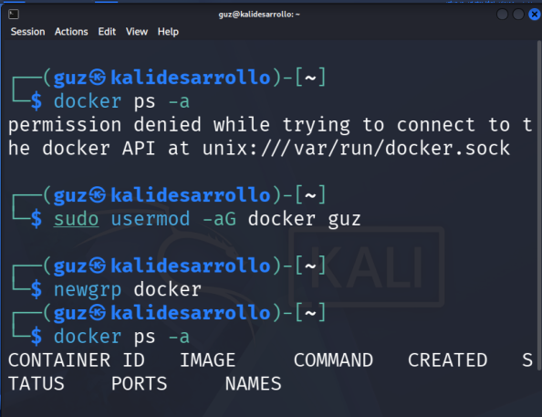

# Ejecución de OWASP Juice Shop <a name="juice-shop" />

En la [página provista](https://owasp.org/www-project-juice-shop/), uno de los
métodos de instalación indicados en el sidebar es con docker, que lleva a la
página [del proyecto en Docker
Hub](https://hub.docker.com/r/bkimminich/juice-shop).

Ahí se detalla el método de instalación, que consiste en correr la imagen
con el puerto donde corre expuesto.

```bash
docker run --rm -p 3000:3000 bkimminich/juice-shop:v20.2.0
```

En este write-up abrevio al único comando necesario, que automáticamente
descarga la imagen necesaria y no los dos escritos en los docs. Además agrego
la versión porque se me hizo pertinente hacer el write-up más
reproducible. Este comando va a exponer la aplicación en el puerto `3000`
(indicado por el primer número), y va a correr la versión indicada. La bandera
`--rm` le indica al daemon que cuando cierre la sesión interactiva que corre el
contenedor, este debe ser eliminado y no persistido.

Para más facilidad de ejecución, esto se puede traducir a un archivo Docker
Compose, que es lo que haré.

```yaml
services:
  juice-shop:
    image: bkimminich/juice-shop:v20.2.0
    restart: unless-stopped
    ports:
      - 3000:3000
```

La traducción es directa, pero añado el atributo `restart: unless-stopped` para
que el contenedor persista si se reinicia la máquina virtual, porque se hará
utilización constante del proyecto en la misma.

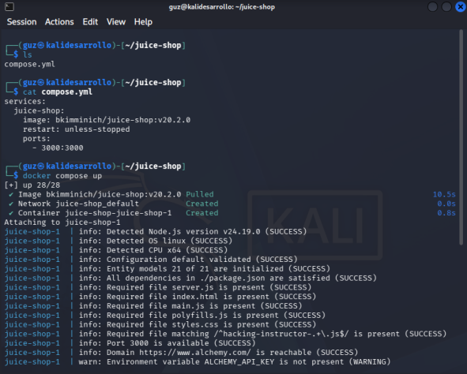

Luego de correr la aplicación, se puede apreciar que esta está corriendo en el
puerto que se indicó anteriormente, y Juice Shop se puede acceder en
`localhost:3000` a través del navegador.

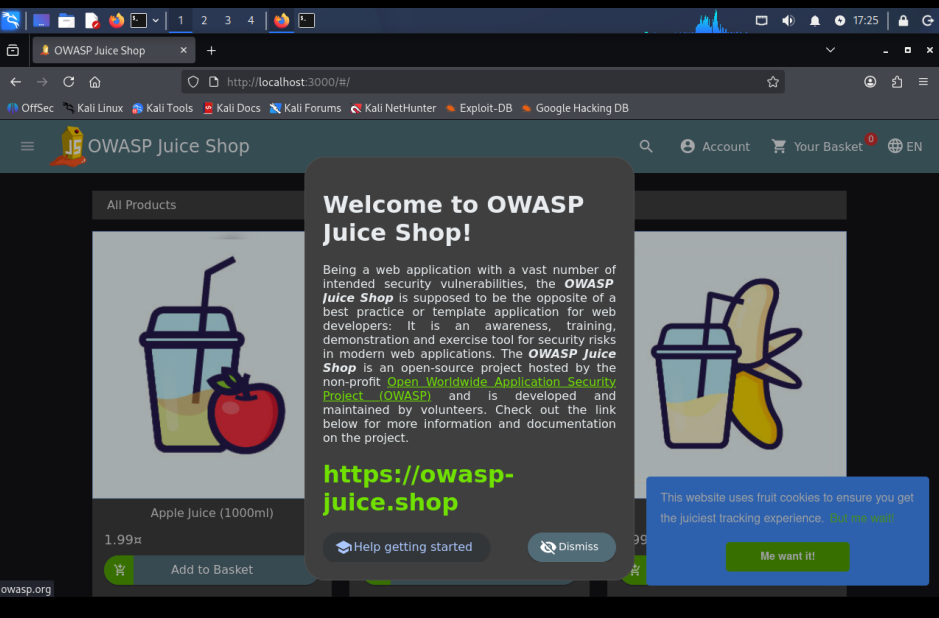

# Ejecución de Crappi <a name="crappi" />

Usaré la guía [aquí](https://owasp.org/crAPI/), que será reproducida en este
documento por completitud.

La instalación consiste en descargar el repo de github, y correr el proyecto
usando docker compose

```bash
curl -L -o /tmp/crapi.zip https://github.com/OWASP/crAPI/archive/refs/heads/main.zip
unzip /tmp/crapi.zip
cd crAPI-main/deploy/docker

docker compose --compatibility up -d
```

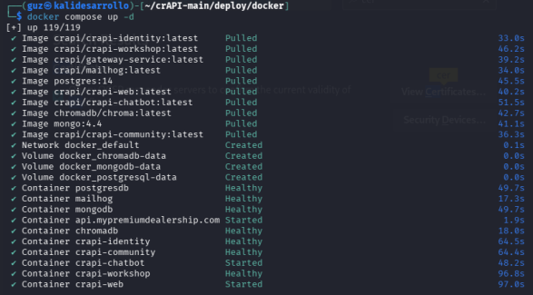

Esto inicia todos los servicios necesarios para correr la API, y expone la página
principal en `http://localhost:8888`

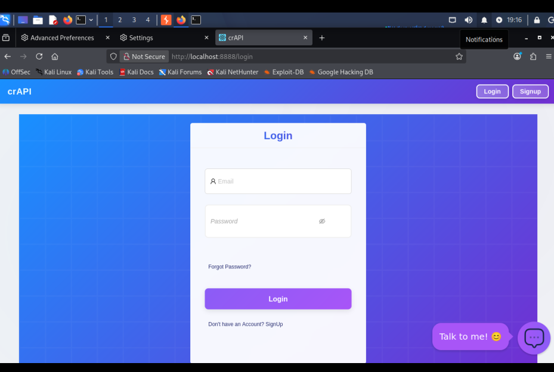

# Prueba de la visualización del tráfico <a name="visualizacion" />

Con Juice Shop corriendo uno puede dirigirse a `http://localhost:3000` en
Firefox, con la proxy prendida, y notar que no se ve absolutamente nada en el
proxy. Esto es porque, por defecto, Firefox no envía solicitudes a la interfaz
loopback (127.\*.\*.\* para IPv4 y ::1 para IPv6) por el proxy configurado,
porque no tiene mucho sentido hacer esto para el uso común de proxies en el
navegador (pasar tráfico por una máquina intermedio para cambiar la IP que
envía el tráfico al servidor destino).

Sin embargo, para nuestro uso sería pertinente que sí lo envíe por el proxy,
para poder interceptar el tráfico. La forma más fácil de resolver esto sería
usar el navegador incluído en Burp, pero eso es aburrido.

En `about:config` se puede cambiar el valor del ajuste
`network.proxy.allow_hijacking_localhost` a `true`, para que el navegador
efectivamente use el proxy para conexiones a la interfaz loopback[^proxynote]

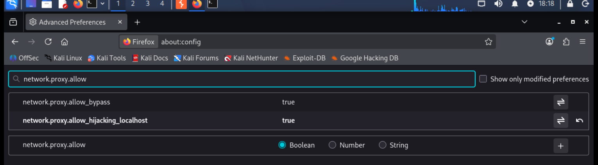

Si se intenta ir a la página de Juice Shop ahora en el navegador, se puede
visualizar el tráfico interceptado en Burp.

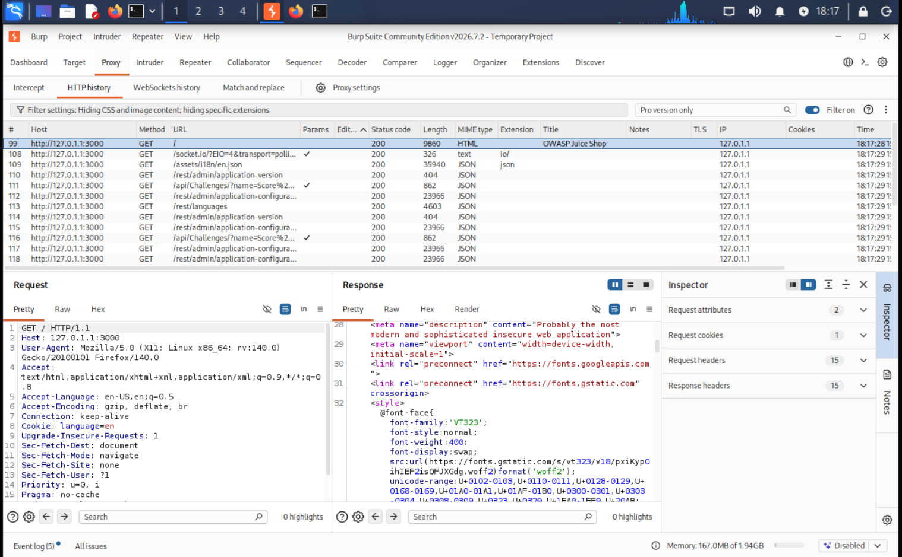

[^proxynote]: La fuente de esto es https://stackoverflow.com/questions/57419408/how-to-make-firefox-use-a-proxy-server-for-localhost-connections
